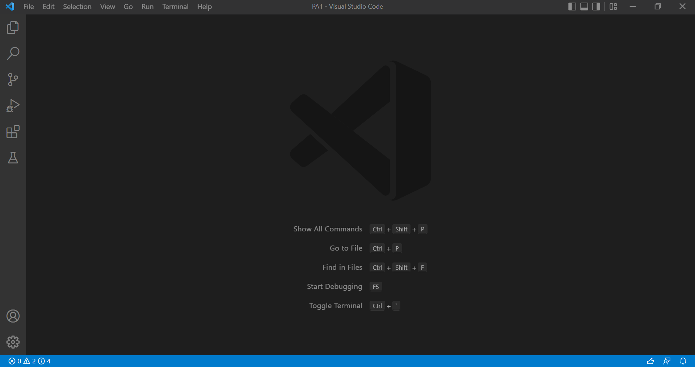
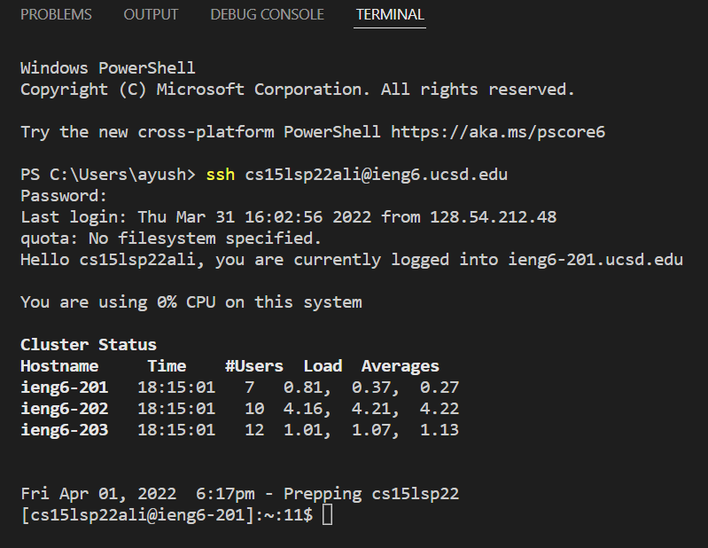
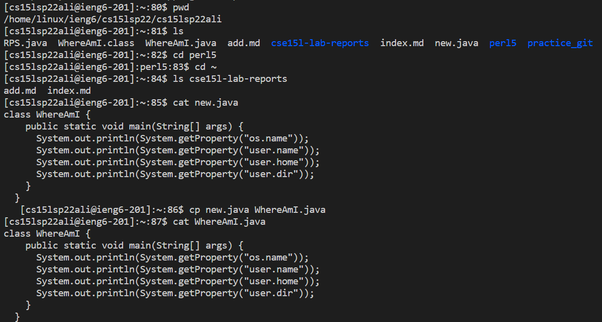
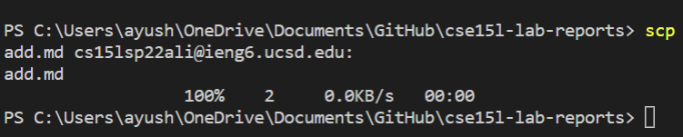
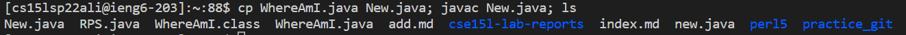
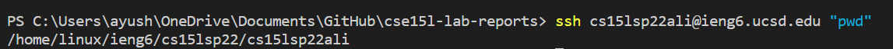

## Downloading VS Code

To download VS Code, go to the following link [VS Code Downlad.](https://code.visualstudio.com/)

Once you are on the page, click on the **Download** button and follow the set up instructions from there.

Once you have completed the set up, you should be able to see something like this when you open the VS Code

## Remotely Connecting 

We use **Secure Shell (sch)** to securely connect to the remote servers

To connect to remote servers, enter the following command in the terminal of your computer:

**ssh (user_name)@ieng6.ucsd.edu** where (user_name) is the user name assigned to you.

After completing the above step, you will be prompted to enter you password. Note: *The password you enter will not be visible, not even astriks, but it will be registered.*

After you enter your password and press enter/return, you will be logged into the remote server.

After you've logged into the servers, you should be able to see something like this:

## Some Commands

A few of the commands that we can do on the remote server are:

* **pwd** This command prints the current working directory

* **ls** This command lists down all files and directories in the current directory

* **cd (directory_name)** This changes the directory to the specified (directory_name)

* **cd ~** This changes the current directory to home directory

* **ls (directory)** This lists down all files and directories in the specified (directory)

* **cat (file_name)** This prints the contents of the file

* **cp (file_1) (file_2)** This copies the contents of (file_1) to (file_2)

All the above commands should look like this in the terminal:

## Moving Files from Client to Server

We use the **Secure Copy (scp)** command to securely copy files files from client to the server

To transfer files from client to a remote server, type in the following command in the terminal of your client:

**scp (file_name) (user_name)@(server_name):** where

* *(file_name)* is the name of the file you want to transfer. Note: Make sure that file is in the current working directory of your terminal

* *(user_name)* is the user name assigned to you

* *(server_name)* is the name of the server. In our case, server name is ieng6.ucsd.edu

* Note: Do not forget the colon at the end

Once you complete the above step, you should have transferred the files to your remote server and should be able to see something like this:

## Setting an SSH Key

To set up an SSH Key, enter the following commands in your terminal on the client computer: **ssh-keygen**

Once you've done the above step, you'll be prompted to enter the name name of the file where you want to store the key, just **press enter**

You will then be asked for a paraphrase twice, **press enter** for both of them

Once you've done the above steps, you will be shown the key fingerprint and a randomart image

Now type in **ssh-keygen -t ed25519**. This step will store the public key in your .ssh directory

Now log on to the remote server and type in **mkdir .ssh**. After doing this, log out from the server by simply closing the window.

Once you're back on your client computer, type in the following command:

**scp /Users/(user_name1)/.ssh/id_rsa.pub (user_name2)@(server_name):~/.ssh/authorized_keys** where

* *(user_name1)* is the your user name on you client, most likely you first name

* *(user_name2)* is the user name assigned to you on the remote server

* *(server_name)* is the name of the server, in our case, **ieng6.ucsd.edu**

After you've done all the above steps, you ssh key will be set up and you will no longer have to type in the password every time you log onto the server!

## Optimizing Remote Running

* You can press the **Up Arrow Key** to type-in the previous commands that you've done on the command line

* You can use **semicolon** to perform multiple operations at one time. For example, you can use this command to copy code from a file WhereAmI.java to New.java and compile the new file, and then print the files in the directory: **cp WhereAmI.java New.java; javac New.java; ls**

* You can use **" "** to run commands on your remote server using your client computer in this way: **ssh (user_name)@ieng6.ucsd.edu "command"**. Where *(user_name)* is the user name assigned to you on the remote server and command can be any command like ls.

