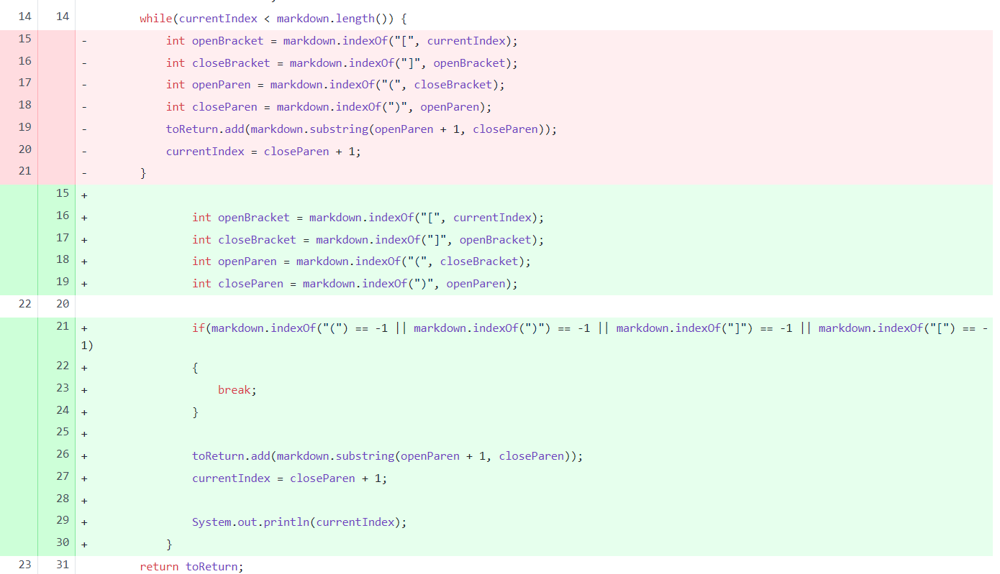
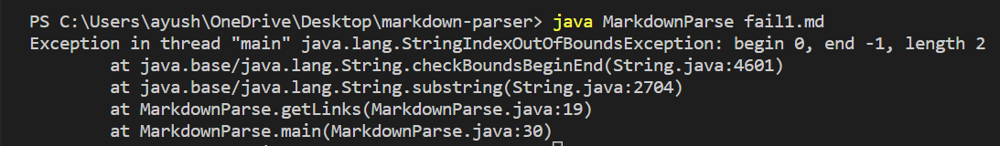
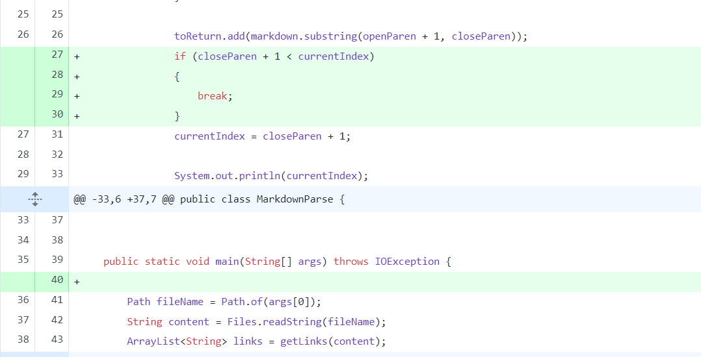
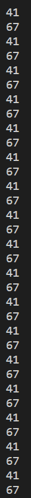
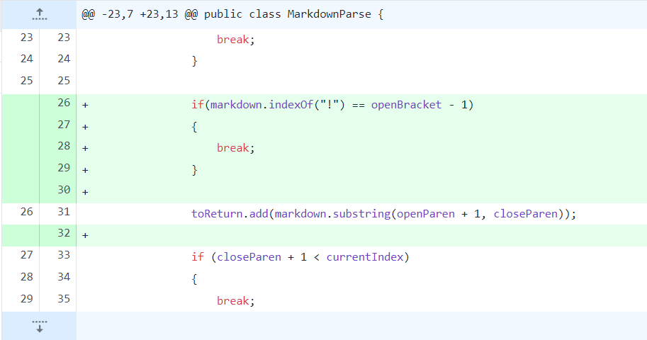
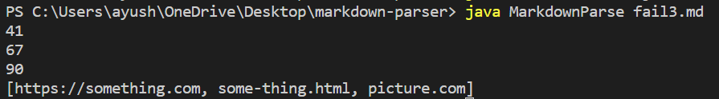

## Code Change One

**Code Change**

**Link to failure-inducing input**

[Failure inducing output 1](https://github.com/ayushs2725/markdown-parser/blob/main/fail_1)

**Image of symptom**

*The bug in the code is that the the index of closing bracket depends on the index of opening bracket and index of closing paran depends on the index of opening paran. But in the failure-inducing input file, there is no opening bracket. Because of this, since index of opening bracket is -1, it produce a symptom of indexOutOfBounds exception when it tries to access index -1.*

## Code Change Two

**Code Change**

**Link to failure-inducing input**

[Failure inducing output 2](https://github.com/ayushs2725/markdown-parser/blob/main/fail_2.md)

**Image of symptom**

*The bug in the code is that the while loop goes around till the current index is less than the length of the input file. In the failure-inducing input file, there is an extra-line at the end of the file. Due to this, the length of the input file will always be atleast one greater than the current index, hence, it produces a symptom of an infinte loop*

## Code Change Three

**Code Change**

**Link to failure-inducing input**

[Failure inducing output 3](https://github.com/ayushs2725/markdown-parser/blob/main/fail_3.md)

**Image of symptom**

*The bug in the code is that it considers everything with square brackets and parans a link. In the failure-inducing input file, it's giving an image not a link but still it's considered a link. Due to this, it produces a symptom of including image link in the output*