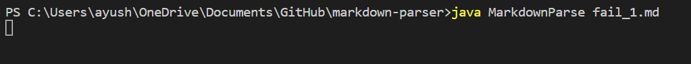
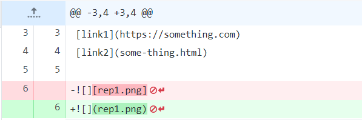
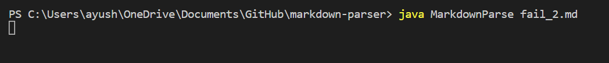

## Code Change One

**Code Change**

**Link to failure-inducing input**

[Failure inducing output 1](https://github.com/ayushs2725/markdown-parser/blob/main/fail_1)

**Image of symptom**

*The bug in the code is the presence of a blank line at the end of the file. This produces a symptom of infinite loop. The blank line is at the end of the input file.*

## Code Change Two

**Code Change**

**Link to failure-inducing input**

[Failure inducing output 2](https://github.com/ayushs2725/markdown-parser/blob/main/fail_2.md)

**Image of symptom**

*The bug in the code is the incorrect use of square brackets instead of parantheses. This produces a symptom of infinite loop. The incorrect brackets are in the test file*