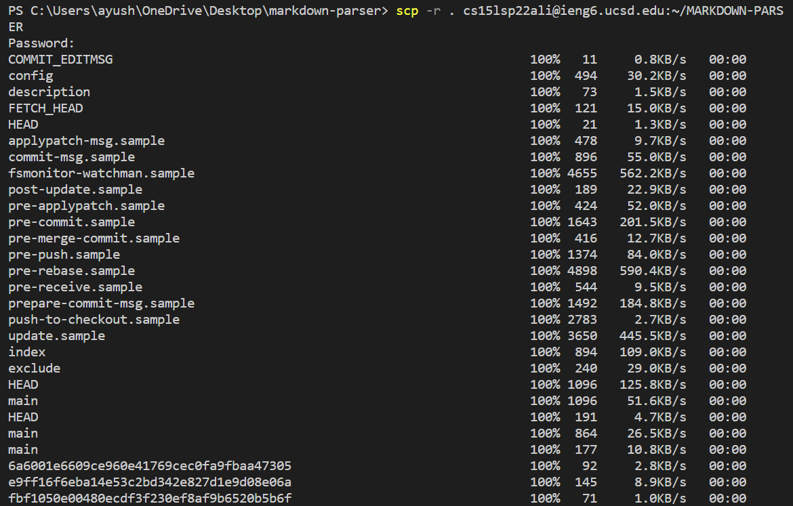
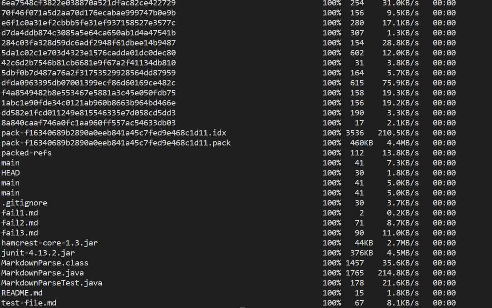
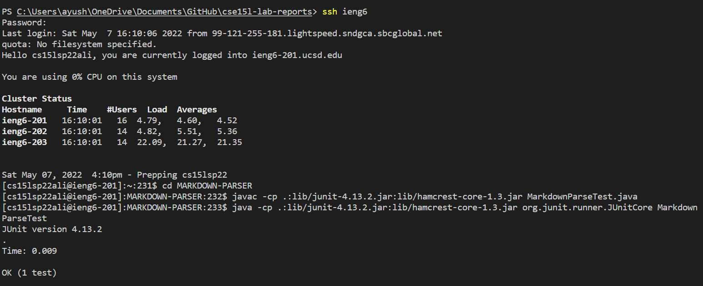

## Streamlining ssh Configuration

**Instead of having to type in the whole user_name@server_name.ucsd.eng everytime you want to log on to the server, you can configure the ssh file so that you just have to enter the server name when you want to log onto the server**

**To open the config file, type in ```~/.ssh/config``` in the terminal of VS Code**


You should be able to see something like this:


Now, in the VS code, add ```User cs15lsp22zzz``` where ***zzz*** are the unique 3 letters assigned to you


Once you've done that, you should be able to log into your server using ```ssh ieng6```


To copy a file from client server to remote server, use the following command: ```scp (file_name) ieng6:```


## Copying Whole Directories

**Instead of copying all files individually, we can copy all files at once using the following command**

Let ***dir*** be the name of the directory you want to copy, enter the following command: 

```scp -r . cs15lsp22zzz@ieng6.ucsd.edu:~/dir``` where ***zzz*** is your unique code 

You should see something like this




Running the tests on server:

