[Link to Markdown-Parser](https://github.com/ayushs2725/markdown-parser)

[Link to Reviewed File](https://github.com/ayushs2725/markdown-parser-review)


## Snippet One

### JUnit Test
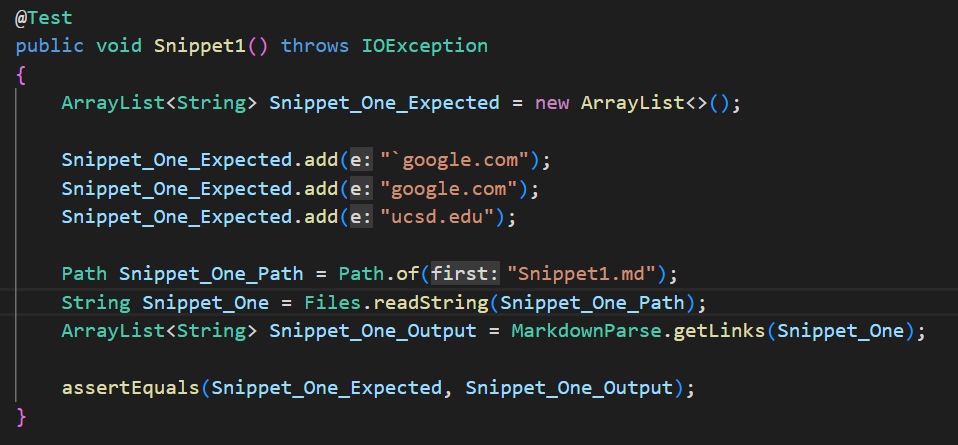

### Expected Output
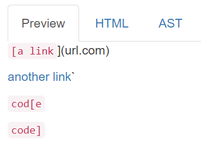

### JUnit test on Markdown-Parser
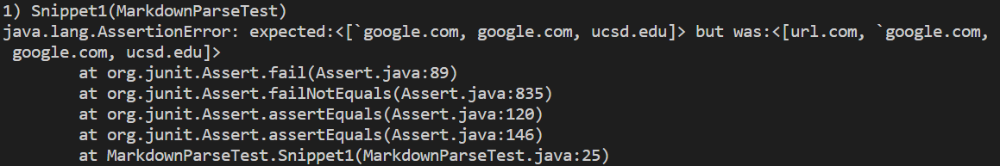

## JUnit test on Reviewed File 
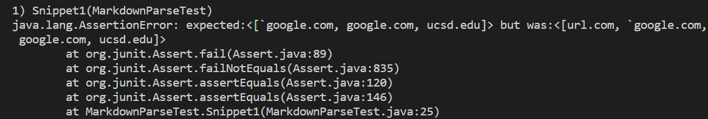

## Fix to the code

The fix would be a small fix (<10 lines). The error that's causing an error in this case is that the link is contained between quotes which makes is a string, not a link. I do have a fix in mind but I'm not exactly sure how to implement it. We can do it by checking if any of the square bracket, either opening or closing, is contained between ```" "```. At the same time, we have to make sure that it's not a single ```"``` but it should be between two of them. By doing this, we'll make sure that the given statement is a link and not a string.


## Snippet Two

### JUnit Test
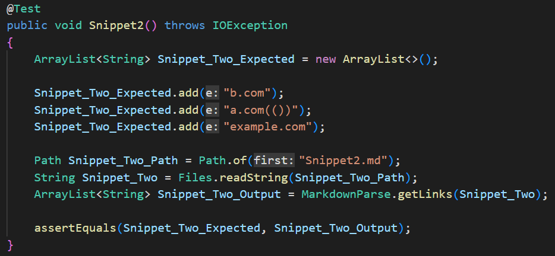

### Expected Output
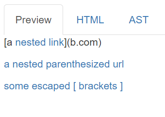

### JUnit test on Markdown-Parser
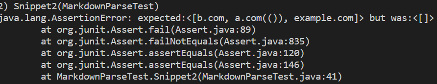

## JUnit test on Reviewed File 
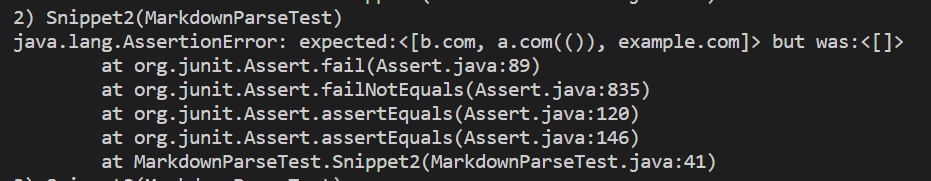

## Fix to the code
The fix would be a small fix (<10 lines). The error in the code is that link has parantheses in its name and link. This confuses the code about between which parantheses are the links contained. I do have a fix in mind but not exactly sure how to change it. We can implement a code that that only considers the first opening square bracket and the last closing bracket before the opening paratheses. By doing this, even if the user has used multiple opening and closing brackets, we'll only be looking at the ones that define the boundaries of the link.

## Snippet Three

### JUnit Test
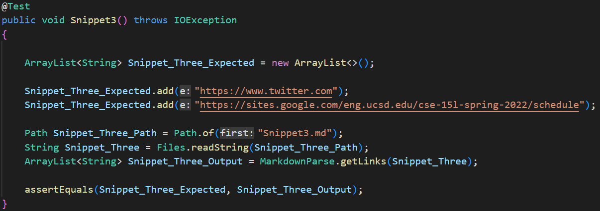

### Expected Output
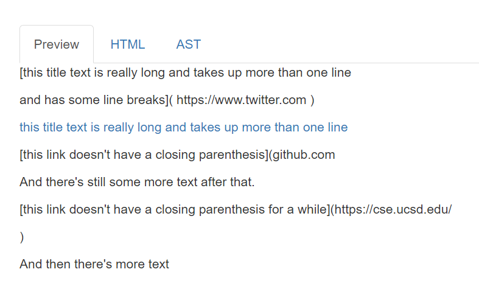

### JUnit test on Markdown-Parser
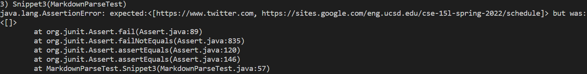

## JUnit test on Reviewed File 
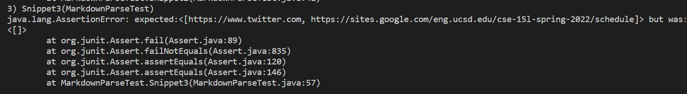

## Fix to the code

The fix would be a small fix (<10 lines). The error in this case is that there are newline characters in the name and the link but a link in not supposed to contain new-line characters. One of the simple fixes that I have in mind is to include a conditional that checks if the input file contains any new line characters. If it does, then, we can continue. By doing this, we'll be skipping all new lines and will only be looking be the lines which contains links.