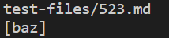
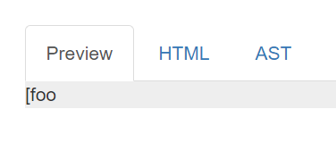
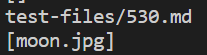
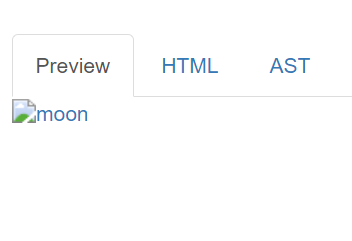

## Finding Tests with Different Results

To find the tests with different results, we first need to create a file that contains the outputs of all files. To do that, we use a bash for loop and store it in a different file.
The bash command to run a for loop and save it in a different file is ```bash (name_of_file) (name_of_file_to_save_in)```

From there on, we can use the ```vimdiff``` command on results.txt file to see tests which yeild different results.


## Failing Test 1 (523.md)

### Which implementation is correct?

In this case, I believe none of the implementations are correct since my implementation goes into an infinite loop and the given implementation outputs the name of an incorrectly written link. For this case, I'll consider the provided implementation.

### Actual and Expected Output

Actual:


Expected:



### Description of the Bug

The bug in the code is that it considers everything that has opening and closing brackets and opening and closing parantheses a link. This inupt file contains a string which has the closing square bracket which makes the link incomplete and hence, the output should've been an empty list.

### Change to be made

We can change this by adding an if statement which makes sure any of the opening or the closing square bracket or the paranthese is contained between quotes.


## Failing Test 2 (530.md)

### Which implementation is correct?

In this case, I believe the provided implementation is incorrect since the given implementation outputs the name of an incorrectly written image link.

### Actual and Expected Output

Actual:


Expected:


### Description of the Bug

The bug in the code is that it considers anything that contains opening and closing brackets and opening and closing paranthese a link. In this specific case, they've tried to give us an image link, so that should not be considered a link

### Change to be made

We have to add an additional if statement that checks and verifies if the given link is a link and not an image. To do this, we simple add:

 ```if(markdown.charAt(nextOpenBracket) - markdown.charAt(!) == -1)```

```{```

```break;``` 

```}```